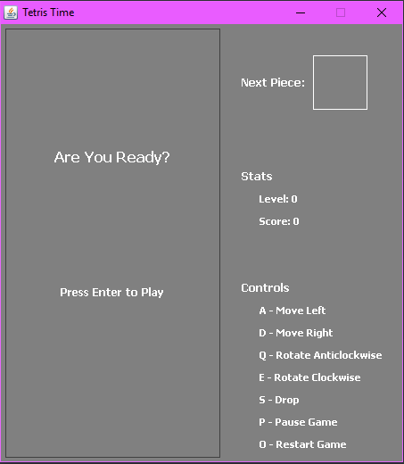
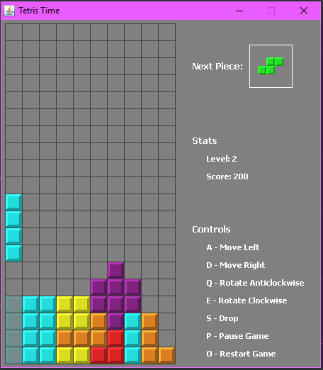

# Tetris_Time
## Details
Tile-matching puzzle game.
## How to play
- "A" Move left.
- "D" Move right.
- "Q" Rotate anticlockwise.
- "E" Rotate clockwise.
- "S" Drop.
- "P" Pause game.
- "O" Restart game.
  Gameplay
- MenuScreen   

- Tetris Gameplay   

## Contributors
- [**Supanut Petchnapaphan**](https://github.com/SupanutK) 6010545927
- [**Pittayoot Ruangrungratanakul**](https://github.com/khaopanbit) 6010545862
